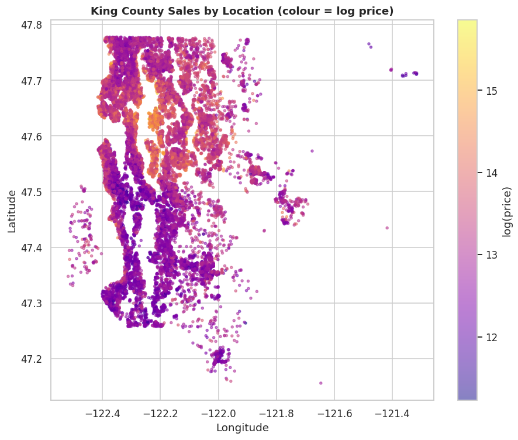
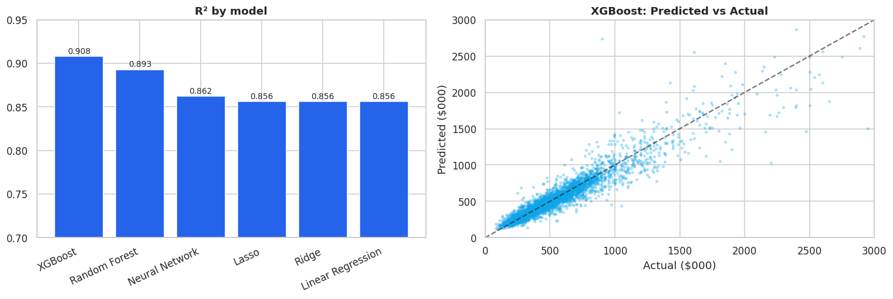
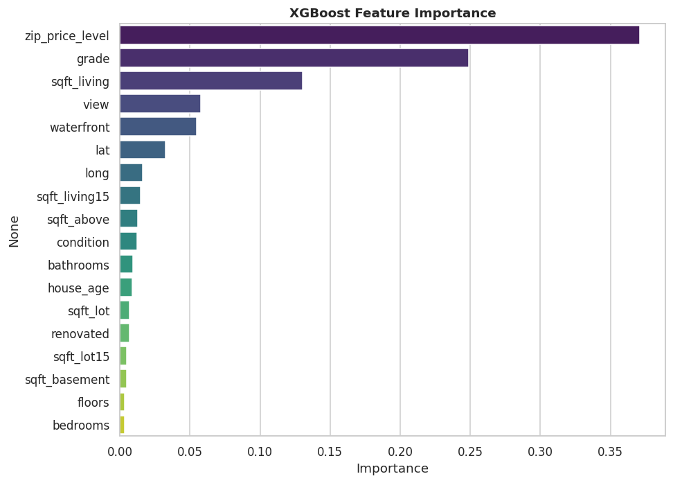
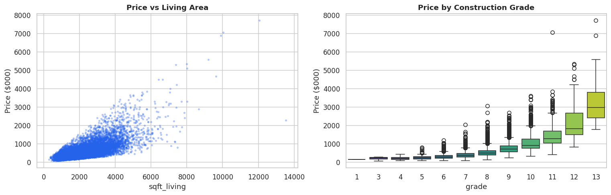
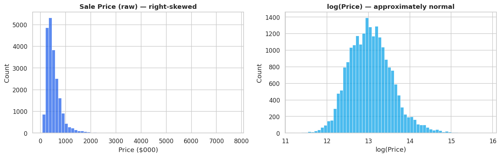

# 🏡 House Price Prediction — King County, Seattle

> Predict a home's sale price from its size, quality and location — with full EDA, a six-model benchmark (Linear → XGBoost → Neural Net), and an interactive **Streamlit** demo.

<p align="center">
  
  
  
  
  
  
</p>

<p align="center">
  <a href="https://house-price-prediction-bsu7kt2kje8hlcndt8m2tn.streamlit.app/"></a>
</p>

<p align="center"><b>Best model — XGBoost · R² = 0.908 · RMSE ≈ $119k</b></p>

<p align="center">
  
</p>

---

## 🎯 Overview

An automated valuation model (AVM) for residential real estate. Using **21,613 home sales** in King County,
Washington (Seattle and surrounds, May 2014 – May 2015), this project predicts **sale price** from a home's
attributes — and explains *what drives* that price.

> **TL;DR** — Price is driven by **construction grade, living area and location**. After log-transforming the
> right-skewed target and engineering location/age features, **XGBoost explains ~91% of the variance** with a typical
> error around **$119k**. Tree ensembles beat both linear models and a neural network — the expected result on tabular data.

## 🏆 Results

Six models, one shared 80/20 hold-out, ranked by R² on log-price:

| Model | R² | RMSE | MAE |
|---|:--:|:--:|:--:|
| **XGBoost** ⭐ | **0.908** | **$118,694** | **$65,181** |
| Random Forest | 0.893 | $138,702 | $71,142 |
| Neural Network (Keras) | 0.862 | $167,143 | $85,822 |
| Lasso | 0.856 | $226,538 | $89,392 |
| Ridge | 0.856 | $229,915 | $89,580 |
| Linear Regression | 0.856 | $230,035 | $89,593 |

<p align="center">
  
</p>

## 🎮 Live Demo

An interactive **Streamlit** app prices a house from its attributes (size, grade, condition, zipcode…).

```bash
pip install -r requirements.txt
streamlit run app/app.py
```

> Deploy it free on Streamlit Community Cloud — see [`STEPS.md`](STEPS.md). After deploying, drop the URL here:
> **▶️ Live demo:** **https://house-price-prediction-bsu7kt2kje8hlcndt8m2tn.streamlit.app/**

## 🔑 What drives price?

<p align="center">
  
</p>

The strongest predictors are **construction grade**, **living area (sqft)** and **location** (a target-encoded
zipcode price level, latitude, and neighbourhood home sizes), with sharp premiums for **waterfront** and **view**.

<p align="center">
  
</p>

## 📊 A look at the data

<p align="center">
  
</p>

Sale price is heavily **right-skewed** (skew ≈ 4), so we model **log(price)** — which is approximately normal and
gives every model a fairer target.

## 🗂️ Repository structure

```
Ankit_Saxena_House_Price_Prediction/
├── House_Price_Prediction.ipynb   # Full notebook: EDA → feature engineering → 6 models → drivers
├── data/
│   └── kc_house_data.csv          # King County sales (21,613 × 20)
├── app/
│   ├── app.py                     # Streamlit demo
│   ├── house_price_model.joblib   # Trained XGBoost model
│   ├── zipcode_lookup.csv         # Zipcode → geo / neighbourhood / price-level
│   └── model_meta.json            # Feature list + metrics
├── assets/                        # All generated figures
├── reports/                       # Written report (DOCX + PDF)
├── requirements.txt · STEPS.md · LICENSE · README.md
```

## 🚀 Run it yourself

```bash
git clone https://github.com/AnkitSaxena-AI/house-price-prediction.git
cd house-price-prediction
pip install -r requirements.txt
jupyter notebook House_Price_Prediction.ipynb     # the analysis
streamlit run app/app.py                          # the demo
```

## 🧠 Methodology highlights

- **Cleaning:** fixed the well-known `bedrooms = 33` typo; engineered `house_age`, `renovated`, `has_basement`.
- **Target:** modelled **log(price)** to handle right-skew.
- **Location:** **target-encoded zipcode** (leakage-safe — fit on train only) plus latitude/longitude and
  neighbourhood sizes.
- **Models:** Linear / Ridge / Lasso, Random Forest, XGBoost, and a Keras neural network (target-scaled for stable
  convergence), all judged on one shared split.
- **Deployment:** best model serialised with `joblib` and served through a Streamlit app.

## 👤 Author

**Ankit Saxena** — [@AnkitSaxena-AI](https://github.com/AnkitSaxena-AI)

---

<p align="center"><i>Dataset: King County House Sales (public, Kaggle). For educational use.</i></p>
